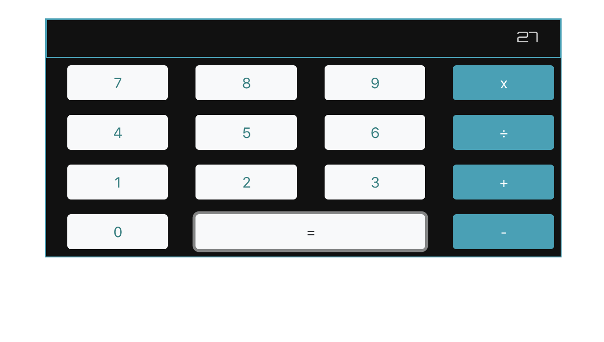

# Calculator

A barely-functioning calculator app.

## Screenshots


## How to run this project
* Use npm to install http-server in your terminal:
```sh
npm install -g http-server
```
* Run the server in your terminal
```sh
hs -p 9999
```
* Open chrome and navigate to:
```
localhost: 9999
```
* Do some very light calculator input. Otherwise you will break it. It is very fickle. But it kind of works.
